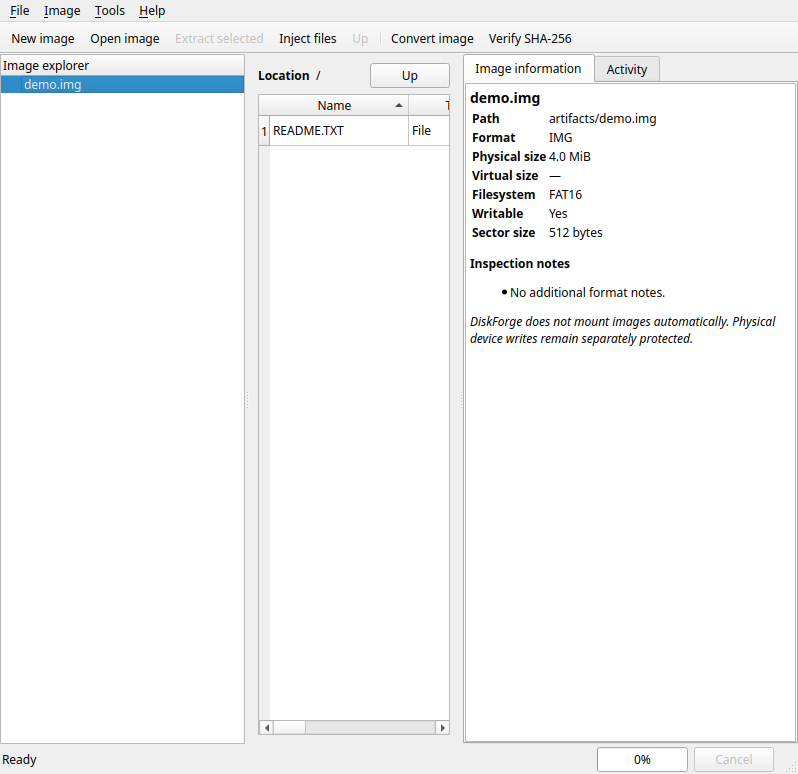

<p align="center">
  
</p>

<h1 align="center">DiskForge</h1>

<p align="center"><strong>Estudio multiplataforma de imágenes de disco para crear, explorar, convertir y restaurar con seguridad.</strong></p>

<p align="center">
  <a href="https://github.com/Piechicken/diskforge/actions/workflows/ci.yml"></a>
  <a href="https://github.com/Piechicken/diskforge/releases"></a>
  <a href="LICENSE"></a>
  
  
</p>

<p align="center">
  <a href="README.md">English</a> ·
  <a href="README.zh-CN.md">简体中文</a> ·
  <a href="README.ja.md">日本語</a> ·
  <a href="README.es.md">Español</a>
</p>

> **DiskForge ofrece a las imágenes de disco un verdadero espacio de trabajo de escritorio.** Cree, inspeccione, explore, extraiga, inyecte, convierta, verifique y restaure imágenes de forma segura en una aplicación original y auditable.

## Descargas de la versión

La primera versión pública incluye cuatro paquetes nativos de escritorio. Descargue desde la [página de Releases](https://github.com/Piechicken/diskforge/releases) el paquete correspondiente a **Windows x64**, **Linux x64**, **macOS Intel** o **macOS Apple Silicon**. Cada paquete se compila y valida en GitHub Actions sobre su ejecutor de destino.

| Plataforma | Paquete | Inicio |
|---|---|---|
| Windows x64 | `DiskForge-v0.3.0-windows-x64.zip` | Descomprima y ejecute `DiskForge.exe`. |
| Linux x64 | `DiskForge-v0.3.0-linux-x64.zip` | Descomprima y ejecute `./DiskForge`. |
| macOS Intel | `DiskForge-v0.3.0-macos-intel-x64.zip` | Descomprima y mueva `DiskForge.app` a Aplicaciones. |
| macOS Apple Silicon | `DiskForge-v0.3.0-macos-arm64.zip` | Descomprima y mueva `DiskForge.app` a Aplicaciones. |

## Qué puede hacer

DiskForge reúne los flujos de trabajo más prácticos para gestionar imágenes en una sola interfaz. La ventana principal combina un explorador de imágenes, tabla de directorios, panel de metadatos, registro de actividad y un área de progreso cancelable. Las acciones destructivas se muestran separadas de la exploración habitual.

| Flujo de trabajo | Capacidad nativa | Notas |
|---|---|---|
| Crear imágenes | RAW/IMG, FAT12, FAT16, FAT32, ISO9660/Joliet | Cree imágenes FAT editables o medios ISO desde un directorio local. |
| Explorar y extraer | FAT12/16/32 e ISO9660/Joliet | Vista de árbol, extracción en lote, información de imagen e inspección MBR/GPT. |
| Cambiar el contenido | Inyección FAT, carpetas recursivas, borrado y edición de fechas | Los ISO se tratan como medios de solo lectura y se reconstruyen desde una carpeta. |
| Convertir formatos | RAW/IMG y VHD fijo de forma nativa | VHDX, VMDK y QCOW2 utilizan un adaptador `qemu-img` configurado explícitamente. |
| Compactar imágenes FAT | Desfragmentación mediante reconstrucción | Crea una imagen nueva y conserva la original como punto de recuperación. |
| Inspeccionar sectores de arranque | Visor/editor hexadecimal de 512 bytes e importación de sectores | Realiza una copia de seguridad completa antes de sustituir el sector. |
| Verificar y automatizar | SHA-256, recetas JSON por lotes y registros auditables | Las recetas no atendidas rechazan las escrituras a dispositivos físicos. |
| Crear paquetes redistribuibles | Archivos autoextraíbles `.pyz` verificados con SHA-256 | Se pueden integrar en un flujo de empaquetado con lanzador nativo. |
| Leer y escribir medios físicos | Lectura y restauración en flujo | Rechaza discos del sistema, destinos montados y tamaños incompatibles; requiere confirmación escrita. |

## Seguridad primero

> Una utilidad de imágenes de disco debe hacer que las operaciones peligrosas sean **difíciles de activar por accidente**.

DiskForge no monta imágenes ni escribe dispositivos físicos automáticamente. Antes de una escritura física comprueba la capacidad, el estado de montaje y si se trata de un disco del sistema; después exige la frase exacta `ERASE`. La ruta de escritura puede verificar los bytes al finalizar. Los cambios del sector de arranque también crean primero una copia de seguridad de la imagen completa. Practique siempre con imágenes desechables antes de operar con medios irreemplazables.

## Empiece en minutos

### Ejecutar desde el código fuente

```bash
python -m pip install -e '.[dev]'
diskforge
```

### Usar la línea de comandos

```bash
diskforge-cli create-fat demo.img --size-mib 32 --fat 16
diskforge-cli info demo.img
diskforge-cli list demo.img
diskforge-cli --help
```

### Crear un paquete nativo

```bash
python scripts/build.py
```

Compile en cada sistema operativo de destino para generar su aplicación nativa. El flujo de trabajo del repositorio realiza estas compilaciones automáticamente para los cuatro objetivos de publicación.

## Cobertura de formatos

| Formato o sistema de archivos | Inspección | Explorar / modificar | Crear / convertir |
|---|---:|---:|---:|
| RAW / IMG / IMA / BIN | Sí | Cargas FAT | Sí |
| FAT12 / FAT16 / FAT32 | Sí | Sí | Sí |
| ISO9660 / Joliet | Sí | Lectura y extracción | Crear desde carpeta |
| VHD fijo | Sí | Convertir la carga | Sí |
| VHDX / VMDK / QCOW2 | Con adaptador | Mediante flujo de conversión | Con adaptador |
| NTFS / EXT / DMG | Indicio de firma o partición | Sin modificación nativa | Use un flujo externo compatible |

DiskForge expone con claridad las rutas de edición no compatibles en lugar de intentar escrituras inseguras. Configure `qemu-img` en **Tools → Preferences** cuando necesite convertir discos virtuales; la aplicación nunca descarga ni ejecuta un conversor externo silenciosamente.

## Calidad de ingeniería

El proyecto cubre con pruebas automatizadas la creación y edición FAT, creación y extracción ISO, VHD fijo, sumas de comprobación, análisis MBR, autoextractores, seguridad de escritura a dispositivos, copias de seguridad de sectores de arranque, exportación de directorios y compactación FAT por reconstrucción. La interfaz también se valida fuera de pantalla. La integración continua ejecuta pruebas en Windows, Linux, macOS Intel y macOS Apple Silicon, y empaqueta cada destino nativo.

```bash
QT_QPA_PLATFORM=offscreen pytest
QT_QPA_PLATFORM=offscreen python scripts/gui_smoke.py
```

Consulte [BUILDING.md](docs/BUILDING.md) para detalles de compilación y publicación. La nota de validación visual está disponible en [gui_validation.md](artifacts/gui_validation.md).

## Contribuir

Se aceptan issues y pull requests. Mantenga los cambios enfocados, añada pruebas de regresión para los cambios de comportamiento y nunca incluya imágenes de disco reales, credenciales, rutas privadas ni resultados de compilación generados en los commits.

## Licencia

DiskForge se distribuye bajo la [licencia MIT](LICENSE).
