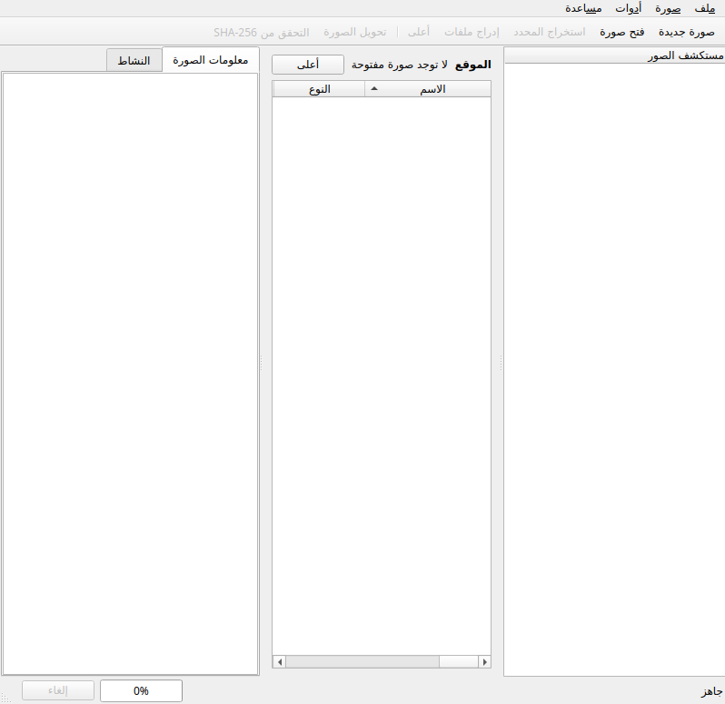

<p align="center">
  
</p>

<h1 align="center">DiskForge</h1>

<p align="center"><strong>Studio d’images disque multiplateforme pour des flux de création, d’exploration, de conversion et de récupération en toute sécurité.</strong></p>

<p align="center">
  <a href="https://github.com/Piechicken/diskforge/actions/workflows/ci.yml"></a>
  <a href="https://github.com/Piechicken/diskforge/releases"></a>
  <a href="LICENSE"></a>
  
  
  
</p>

<p align="center">
  <a href="README.md">English</a> ·
  <a href="README.zh-CN.md">简体中文</a> ·
  <a href="README.ja.md">日本語</a> ·
  <a href="README.es.md">Español</a> ·
  <a href="README.fr.md">Français</a> ·
  <a href="README.ru.md">Русский</a> ·
  <a href="README.ar.md">العربية</a>
</p>

> <strong>DiskForge offre aux images disque un véritable espace de travail de bureau.</strong> Créez, inspectez, parcourez, extrayez, injectez, convertissez, vérifiez et restaurez des images en toute sécurité, sans reléguer un lecteur physique au second plan.

## Téléchargements de versions

La première version publique fournit quatre builds de bureau natifs. Téléchargez le paquet correspondant à votre système d’exploitation depuis la page des [Releases](https://github.com/Piechicken/diskforge/releases) : **Windows x64**, **Linux x64**, **macOS Intel** ou **macOS Apple Silicon**. Chaque paquet est construit et validé dans GitHub Actions sur son exécuteur cible.

| Plateforme | Paquet | Lancement |
|---|---|---|
| Windows x64 | `DiskForge-v0.10.0-windows-x64.zip` | Extraire, puis exécuter `DiskForge.exe`. |
| Linux x64 | `DiskForge-v0.10.0-linux-x64.zip` | Extraire, puis exécuter `./DiskForge`. |
| macOS Intel | `DiskForge-v0.10.0-macos-intel-x64.zip` | Extraire, puis déplacer `DiskForge.app` vers Applications. |
| macOS Apple Silicon | `DiskForge-v0.10.0-macos-arm64.zip` | Extraire, puis déplacer `DiskForge.app` vers Applications. |

## Langues de l’interface

DiskForge v0.10.0 localise, à l’exécution, l’espace de travail documentaire ainsi que les parcours FAT-template, importation sûre du code d’amorçage, VHD fixe éditable, sélection de partition, remplacement ISO sécurisé, conteneur ZIP hérité, montage en lecture seule, MBR de périphérique, support amovible, contrôleur floppy et chemins UFI USB floppy protégés. Sélectionnez **Outils → Langue** pour passer immédiatement entre les six langues de travail des Nations Unies—**arabe, chinois, anglais, français, russe et espagnol**—ainsi que **japonais**. La préférence est conservée pour le prochain lancement. Le choix de l’arabe bascule toute la disposition Qt en lecture de droite à gauche tout en préservant les valeurs techniques telles que les chemins de périphériques, checksums, extensions de fichiers et la phrase de confirmation d’écriture physique `ERASE`. La couverture de l’UI UFI n’implique pas une acceptation complète du formatage par le matériel réel.

Lisez [LOCALIZATION.md](docs/LOCALIZATION.md) pour la matrice des langues, le comportement RTL, les limites de sécurité et le flux de maintenance des traductions.

<p align="center">
  
</p>

## Fonctionnalités

DiskForge réunit les flux de gestion d’images les plus utiles dans une application originale et vérifiable. La fenêtre principale combine un explorateur d’images, une table de répertoires, un panneau de métadonnées d’image, un journal d’activité et une zone de progression annulable. Les actions destructrices sont visuellement isolées de la navigation ordinaire et nécessitent une confirmation explicite.

| Flux de travail | Fonctionnalité native | Notes |
|---|---|---|
| Créer des images | RAW/IMG/IMA, FAT12, FAT16, FAT32, profils disquette FAT12 hérités vérifiés, FAT12 en disposition DMF, modèles FAT, ISO9660/Joliet/Rock Ridge/UDF, HFS classique facultatif | Créez des images FAT éditables à partir de préréglages standard, d’un modèle BPB FAT validé ou de profils disquette IMG/IMA hérités explicites. Le répertoire hérité couvre des dispositions conventionnelles compatibles PC de 160 KiB à 2,88 MiB et une géométrie CHS personnalisée prise en charge. Un média ISO peut être créé à partir d’un répertoire local avec média de démarrage El Torito en option. En présence explicite de `hformat`, DiskForge peut créer une nouvelle image de fichier régulier HFS classique autonome à partir de 800 KiB ; HFS+ reste en lecture seule. |
| Parcourir et extraire | FAT12/16/32—y compris les médias disquette DOS hérités non étiquetés validés et les alias RAW `.vfd`/`.flp`/à suffixe de capacité de taille conventionnelle—candidats prudents de fichiers racine supprimés FAT12/FAT16 ; inspection de conteneurs en lecture seule IMD, TD0, CPC DSK, D88, APRIDISK, CopyQM, SAP, MSA, PSI, DC42, 2MG/2IMG, HFE, PRI, 86F restreint, FDI, JV3, DMK, UDI v1.0, SCP standard, HxC MFM canonique, conteneur de flux PCE PFI v0 canonique, conteneur Apple II WOZ 2.0/2.1 canonique, conteneur de flux A2R 3.x canonique, conteneur G64 v0 1541 GCR canonique, conteneur G71 v0 1571 GCR double face canonique et conteneur P64 v0 1541 à impulsions NRZI canonique ; ISO9660/Joliet, conteneurs ZIP sécurisés à plusieurs images avec sélection explicite, vues de données VHD fixe, et backend facultatif en lecture seule NTFS/EXT2/EXT3/HFS classique/HFS+ | Un ZIP régulier avec une à 64 charges utiles d’image sûres au niveau racine n’est matérialisé que dans une session privée temporaire en lecture seule nettoyée automatiquement. Une charge unique s’ouvre directement ; un ZIP multi-image exige de sélectionner explicitement une charge dans le bureau, la CLI ou le SDK. Il ne devient jamais inscriptible ni convertible. Les alias RAW hérités ne sont classés que si leur suffixe et leur taille exacte en octets correspondent à une forme conventionnelle de disquette PC de 512 octets ; les médias à secteurs variables, XDF, GCR, à secteurs durs et à flux ne sont pas devinés. Les arborescences paginées déterministes et les tableaux triables évitent un rendu de répertoire non borné. Les partitions MBR/GPT validées sont toujours sélectionnées par index de table explicite : FAT conserve son chemin d’édition existant, tandis que NTFS/EXT/HFS classique/HFS+ ne s’ouvrent qu’à leur décalage validé exact via le backend en lecture seule. Un double-clic ouvre un espace de travail documentaire non exécutant pour les textes, images, archives communes, packages d’installation hérités, exécutables et données binaires. Les documents texte peuvent être recherchés, enregistrés en copie et—uniquement pour les entrées FAT inscriptibles—édités puis enregistrés. Un VHD fixe s’ouvre normalement via une vue de données RAW temporaire en lecture seule ; une copie VHD fixe indépendante validée peut être rouverte en session FAT inscriptible. |
| Inventorier des répertoires d’images | Analyse en lecture seule des métadonnées d’images locales avec rapports JSON, CSV ou HTML | Analysez un répertoire local, éventuellement de façon récursive, et filtrez les candidats images connus par suffixe, format reconnu, système de fichiers, plage d’octets ou préfixe SHA-256. Les SHA-256 par enregistrement et les résumés de partitions sont facultatifs. Chaque rapport est un nouveau fichier en dehors de la racine analysée ; aucune image candidate n’est modifiée. |
| Modifier le contenu d’une image | Injection FAT, création explicite de répertoire vide, dossiers récursifs, suppression, renommage, copie de fichiers et d’arbres de répertoires entre répertoires plus déplacement contrôlé, horodatages, attributs DOS et étiquettes de volume ; éditions ISO sûres par reconstruction ; injection NTFS/EXT/HFS classique contrôlée en option | Les charges utiles FAT valides à l’intérieur d’IMG et IMA partagent le même chemin éditable. Un répertoire vide peut être créé explicitement uniquement à un nouveau chemin dont le parent existe déjà ; cela n’écrase jamais ni ne crée de parents implicites. Un fichier régulier ou un arbre de répertoires complet peut être copié vers un répertoire existant sans écrasement ; la copie préserve sa source, exige une nouvelle cible de même nom et rejette une cible répertoire à l’intérieur de l’arbre source. Un fichier ou un arbre de répertoires peut aussi être déplacé vers une telle cible : un répertoire effectue d’abord une copie annulable, puis supprime sa source. Une annulation avant suppression ou un échec de suppression conservent les deux arbres complets pour résolution manuelle, ainsi le déplacement de répertoires n’est pas annoncé comme atomique. Les cibles manquantes/non répertoires, les déplacements à la racine, les collisions, les sessions en lecture seule et les cibles dans l’arbre source sont rejetés avant mutation. Le renommage dans le même répertoire reste une action distincte. La suppression FAT explicite retire un seul fichier ou arbre de répertoires non racine après validation du chemin ; elle est irréversible et n’est pas présentée comme transactionnelle. Les modifications ISO écrivent toujours une image reconstruite distincte et vérifient le contenu mis en scène. Les profils Rock Ridge/UDF sont conservés ; seul un catalogue El Torito à entrée unique vérifiée est reconstruit, tandis que les dispositions multi-boot, hybrides et ambiguës sont rejetées. Avec `ntfsprogs`, `e2fsprogs` ou `hfsutils` disponibles explicitement, NTFS/EXT/HFS classique peuvent recevoir de nouveaux fichiers réguliers du répertoire racine uniquement dans une image de sortie vérifiée séparément ; aucune écriture de source, de décalage de partition, de métadonnées, de renommage, de suppression ou d’écrasement n’est autorisée. L’injection HFS classique transfère uniquement les fourches de données brutes ; HFS+ reste en lecture seule. |
| Convertir des formats | RAW/IMG/IMA et VHD fixe nativement | IMG et IMA conservent leur extension d’image brute explicitement sélectionnée lors de la conversion. VHDX, VMDK et QCOW2 utilisent un adaptateur `qemu-img` configuré explicitement avec rapport de capacités visible et annulation. Un adaptateur `dmg2img` configuré séparément peut seulement créer une nouvelle sortie brute depuis DMG ; DiskForge ne monte pas et n’écrit pas les fichiers DMG. |
| Compacter des images FAT | Défragmentation basée sur la reconstruction | Écrit une nouvelle image, en préservant l’image d’origine comme point de récupération. |
| Inspecter et réparer les structures | Éditeur/visualiseur hexadécimal 512 octets, propriétés d’amorçage FAT validées, modèles originaux neutres/messages, encapsulage MBR neutre et planification de déploiement pour images superfloppy FAT, recadrage par copie des secteurs finaux nuls, sauvegarde/restauration/réinitialisation neutre du MBR et diagnostics CRC GPT | Des sauvegardes d’image complète ou de MBR sont créées avant les changements structurels protégés. Les modèles préservent les champs BPB et n’utilisent aucun programme d’amorçage importé ; l’encapsulage, la préparation au déploiement et le recadrage écrivent toujours un nouveau fichier. |
| Vérifier et automatiser | SHA-256, comparaison octet par octet, studio graphique de recettes par lot, plans de prévol, examen des résultats par élément, recettes JSON versionnées et rapports de répertoires | Le schéma v4 ajoute les déclarations `iso_edit`, `ntfs_inject`, `ext_inject`, `hfs_inject`, `hfs_create`, `export_listing`, FAT `move`, `fat_mkdir`, `fat_copy`, `fat_rename`, `fat_delete` et FAT `fat_metadata` à chemin explicite ; toutes les écritures de recettes peuvent être prévisualisées avant exécution et les écritures vers périphériques bruts restent rejetées. `export_listing` crée uniquement un rapport texte/HTML local et peut cibler une partition en lecture seule explicitement sélectionnée. Les rapports texte/HTML de répertoires utilisent un parcours complet stable pour chaque système de fichiers parcourable et partition en lecture seule explicite. Le concepteur visuel couvre la conversion—y compris la sélection de cible IMA—la validation, la comparaison, le redimensionnement, l’injection, la création HFS classique, l’extraction et les recettes de conteneur. Les comparaisons peuvent en option signaler uniquement les secteurs finaux entièrement nuls comme ignorés. |
| Annoter et redimensionner | Commentaires d’image non intrusifs et redimensionnement RAW/FAT sécurisé vers un nouveau fichier | Les images brutes refusent la réduction si des octets de fin non nuls seraient supprimés. |
| Construire des bundles redistribuables | Conteneurs `.dfb` multi-images authentifiés et archives auto-extractibles `.pyz` multi-images vérifiées par SHA-256 | `.dfb` prend en charge le chiffrement AES-256-GCM issu de scrypt en option, la compression, les commentaires et la vérification par fichier. Chaque paquet natif de plateforme inclut également un `DiskForgeExtractor` séparé qui vérifie et extrait les charges utiles `.pyz` sans nécessiter que le destinataire installe Python au préalable. |
| Lire et écrire des supports physiques | Image et restauration de périphériques en flux | Rejette les disques système, cibles montées et discordances de capacité ; une confirmation tapée est requise. Les médias optiques détectés sont en lecture seule et exportent en ISO par défaut. |
| Formatage bas niveau de disquettes | Backends contrôleur floppy Linux et UFI USB floppy détectés | `fdformat` est limité aux nœuds contrôleur standards. Un candidat UFI USB doit être associé via sysfs à un support amovible, se prouver via `ufiformat -i`, utiliser une capacité explicitement rapportée et la phrase `FORMAT_FLOPPY`, et est toujours vérifié avec `-V`. La création FAT reste une opération distincte, nouvellement confirmée ; l’acceptation par le matériel réel est encore requise pour chaque modèle de lecteur. |

FDI v2.0, DMK, HxC MFM canonique, PCE PFI v0 canonique, WOZ 2.0/2.1 canonique, A2R 3.x canonique, G64 v0 canonique, G71 v0 canonique et P64 v0 canonique sont des inspecteurs de conteneur structurels en lecture seule : aucun ne décode les pistes, bitstreams ou flux, n’ouvre un système de fichiers, ne convertit, ne répare, n’écrit ni ne reconstruit des données RAW. JV3 est également en lecture seule ; il produit une sortie RAW distincte uniquement après que des secteurs normaux prouvent une disposition rectangulaire complète et à géométrie fixe. Toute autre variante de conteneur historique reste conservée pour inspection uniquement ou est rejetée plutôt que devinée ou aplatie.

## La sécurité avant tout

> Un utilitaire d’image disque doit rendre les opérations dangereuses <strong>difficiles à déclencher par accident</strong>.

DiskForge ne monte jamais une image ni n’écrit un périphérique physique automatiquement. Le déploiement FAT produit d’abord une image MBR neutre et révisable ; il ne contourne pas l’opération d’écriture physique protégée. Avant une écriture physique, il vérifie la capacité, l’état monté et le statut de disque système, puis exige la phrase exacte `ERASE`. Le chemin d’écriture peut vérifier les octets après achèvement. Les changements de secteur d’amorçage créent également d’abord une sauvegarde d’image complète. Travaillez toujours avec des images de test jetables avant d’opérer sur des supports irremplaçables.

## Configuration portable

Utilisez `diskforge --portable` pour écrire les préférences, le choix de la langue, les images récentes, le mode d’affichage, le thème, la police et le chemin des outils externes dans `DiskForgeData/diskforge.ini` dans le répertoire courant. Utilisez `--portable=DIR`, `--portable-directory DIR` ou `DISKFORGE_PORTABLE_DIR` pour sélectionner un emplacement explicite. Ce mode utilise un fichier INI portable ordinaire et ne nécessite pas d’entrée de registre système.

## Démarrer en quelques minutes

### Exécuter depuis les sources

```bash
python -m pip install -e '.[dev]'
diskforge
```

### Utiliser la ligne de commande

```bash
diskforge-cli create-fat demo.img --size-mib 32 --fat 16
diskforge-cli info demo.img
diskforge-cli list demo.img
diskforge-cli list partitioned.img --partition 2
diskforge-cli export-listing partitioned.img partition-report.html --html --partition 2
diskforge-cli mkdir-fat demo.img /DOCS  # un nouveau répertoire vide ; le parent doit déjà exister
diskforge-cli copy-fat demo.img /README.TXT /DOCS  # préserve la source ; un fichier ou un arbre de répertoires complet ; pas d’écrasement
diskforge-cli move-fat demo.img /README.TXT /DOCS  # /DOCS doit exister ; un répertoire utilise copie puis suppression annulable
diskforge-cli delete-fat demo.img /DOCS/OLD.TXT  # un fichier ou arbre explicite hors racine ; irréversible
diskforge-cli set-fat-metadata demo.img /README.TXT /DOCS/NOTES.TXT --hidden --modified 2024-06-15T12:34:56  # chemins FAT explicites inscriptibles uniquement
diskforge-cli list archived-image.zip  # une charge utile d’image sûre au niveau racine ; lecture seule
diskforge-cli list-deleted-fat demo.img  # candidats FAT12/FAT16 8.3 à racine fixe uniquement
diskforge-cli recover-deleted-fat demo.img 17 recovered.bin  # une nouvelle sortie locale ; n’écrit jamais demo.img
diskforge-cli imd-info legacy.imd  # audit piste/secteur en lecture seule
diskforge-cli convert-imd legacy.imd exported.img  # uniquement une disposition rectangulaire de données normales prouvée
diskforge-cli td0-info legacy.td0  # audit TD0 ordinaire en lecture seule piste/secteur
diskforge-cli convert-td0 legacy.td0 exported.img  # uniquement une disposition rectangulaire ordinaire non marquée prouvée
diskforge-cli dc42-info disk.dc42  # vérifie l’en-tête, les fourches et les checksums
diskforge-cli convert-dc42 disk.dc42 exported.img  # fourche de données vérifiée uniquement
diskforge-cli twoimg-info apple.2mg  # valide la structure standard 2MG/2IMG
diskforge-cli convert-twoimg apple.2mg exported.img  # bloc de données DOS/ProDOS uniquement
diskforge-cli apridisk-info legacy.dsk  # audit APRIDISK basé sur signature
diskforge-cli copyqm-info archive.qm  # audit CopyQM avec checksum
diskforge-cli sap-info thomson.sap  # audit SAP validé par CRC
diskforge-cli msa-info atari.msa  # décode et valide entièrement les pistes MSA
diskforge-cli psi-info media.psi  # flux de secteurs PSI avec checksum
diskforge-cli pri-info capture.pri  # structure de bitstream PRI validée par CRC
diskforge-cli 86f-info capture.86f  # structure de bitstream 86F v2.12 restreinte
diskforge-cli fdi-info capture.fdi  # structure de conteneur multi-niveaux FDI v2.0
diskforge-cli jv3-info disk.jv3  # inspection du conteneur de secteurs JV3
diskforge-cli convert-jv3 disk.jv3 exported.img  # uniquement une disposition rectangulaire normale prouvée
diskforge-cli dmk-info capture.dmk  # structure native d’en-tête DMK et répertoire IDAM
diskforge-cli udi-info capture.udi  # structure de piste MFM UDI v1.0 en majuscules validée par CRC32 uniquement
diskforge-cli scp-info capture.scp  # structure de piste de flux SCP standard en lecture seule uniquement
diskforge-cli mfm-info capture.mfm  # structure de bitstream HxC MFM canonique uniquement
diskforge-cli pfi-info capture.pfi  # structure de conteneur de flux PCE PFI v0 canonique validée par CRC uniquement
diskforge-cli woz-info disk.woz  # structure de conteneur Apple II WOZ 2.0/2.1 canonique uniquement
diskforge-cli a2r-info capture.a2r  # structure de conteneur de flux A2R 3.x canonique uniquement
diskforge-cli d64-info disk.d64  # structure D64 CBM DOS canonique à 35 pistes et chaînes de fichiers ordinaires vérifiées
diskforge-cli list disk.d64  # liste de répertoire CBM DOS en lecture seule
diskforge-cli d71-info disk.d71  # structure D71 CBM DOS canonique à 70 pistes double face et chaînes de fichiers ordinaires vérifiées
diskforge-cli list disk.d71  # liste de répertoire CBM DOS double face en lecture seule
diskforge-cli d81-info disk.d81  # structure D81 CBM DOS canonique à 80 pistes double face et chaînes de fichiers ordinaires vérifiées
diskforge-cli list disk.d81  # liste de répertoire D81 CBM DOS en lecture seule
diskforge-cli g64-info disk.g64  # structure de conteneur G64 v0 1541 GCR canonique uniquement
diskforge-cli g71-info disque.g71  # structure de conteneur G71 v0 1571 GCR double face canonique uniquement
diskforge-cli p64-info capture.p64  # structure CRC-validée de conteneur P64 v0 à impulsions NRZI canonique uniquement
diskforge-cli inventory-images ./image-library image-library-report.json --recursive --include-sha256  # lecture seule ; le rapport doit être en dehors de la racine analysée
diskforge-cli bundle demo.dfb demo.img --comment "lab media"
diskforge-cli compare demo.img restored.img
diskforge-cli create-dmf demo.dmf
diskforge-cli create-legacy-floppy win16-disk --profile pc525_dsdd_360 --format ima
diskforge-cli create-legacy-floppy custom-disk --format img --cylinders 80 --heads 2 --sectors-per-track 9
diskforge-cli create-iso folder bootable.iso --boot-image boot.img --boot-media noemul
diskforge-cli edit-iso bootable.iso revised.iso --add README.TXT --mkdir /DOCS
diskforge-cli iso-boot-info bootable.iso
diskforge-cli export-boot-image bootable.iso boot.img
diskforge-cli inject-ntfs standalone.ntfs revised.ntfs PAYLOAD.TXT
diskforge-cli inject-ext standalone.ext4 revised.ext4 PAYLOAD.TXT
diskforge-cli inject-hfs standalone.hfs revised.hfs PAYLOAD.TXT
diskforge-cli create-hfs created.hfs --size-kib 800 --label DISKFORGE
diskforge-cli ntfs-inject-status
diskforge-cli ext-inject-status
diskforge-cli hfs-inject-status
diskforge-cli hfs-create-status
diskforge-cli boot-templates
diskforge-cli prepare-fat-deployment demo.img demo-deploy.img
diskforge-cli batch recipe.json --dry-run
diskforge-cli --help
```

### Construire un paquet natif

```bash
python scripts/build.py
```

Construisez sur chaque système d’exploitation cible pour créer l’application native de cette plateforme. Le workflow du dépôt effectue automatiquement ces builds pour les quatre cibles de release.

## Couverture des formats

| Format ou système de fichiers | Inspection | Parcourir / modifier | Créer / convertir |
|---|---:|---:|---:|
| RAW / IMG / IMA / BIN | Oui | Les charges utiles FAT valides dans IMG/IMA sont éditables, prévisualisables, extractibles et hachables | Conversion de copie RAW/IMG/IMA native ; profils FAT12 hérités IMG/IMA explicites et création CHS personnalisée prise en charge |
| IMD | Inspection piste/secteur en lecture seule | Pas d’édition directe de système de fichiers. L’export strict crée un nouveau fichier RAW uniquement après avoir prouvé une disposition CHS rectangulaire complète avec des données normales. | Pas de création IMD ni de conversion sur place. |
| TD0 | Inspection piste/secteur en lecture seule ordinaire et non compressée avec CRC documentés | Pas d’édition directe de système de fichiers. L’export strict crée un nouveau fichier RAW uniquement après avoir prouvé une disposition CHS rectangulaire complète non marquée, fin de fichier exacte, avec coordonnées logiques/physiques concordantes et données ordinaires reconstruites. | Pas de création TD0, de prise en charge de compression avancée, de conversion sur place, de réparation ni de chemin d’écriture. |
| CPC DSK / D88 / APRIDISK / CopyQM / SAP / MSA / PSI | Inspection structurelle spécifique au format en lecture seule | Une nouvelle sortie RAW n’est disponible qu’après que l’analyseur pertinent a prouvé sa disposition propre, complète et rectangulaire secteurs/pistes, la terminaison exacte de l’entrée et les conditions de checksum/CRC applicables. | Pas d’écriture sur la source, de conversion générique, de session système de fichiers, de réparation, de sortie vers périphérique, d’écrasement ni de revendication de média irrégulier/faible/protégé. |
| DC42 / 2MG / 2IMG | Inspection de fourches/conteneurs en lecture seule | DC42 peut exporter une fourche de données entièrement vérifiée ; 2MG/2IMG peut exporter un bloc de données DOS/ProDOS validé, chacun vers un fichier RAW distinct. | Pas d’écriture de conteneur ; les tags DC42 et les dispositions 2MG NIB/irrégulières ne sont pas aplatis. |
| HFE / PRI / 86F | Inspection structurelle de bitstream en lecture seule | HFE valide les plages de pistes en en-tête/LUT ; PRI valide les CRC de chunks, les pistes, horloges et événements ; 86F valide une disposition restreinte v2.12 à bitcells totales et RPM fixes. | Pas de décodage de bitstream, d’export RAW, de session système de fichiers, d’édition, de réparation ni de route vers périphérique. |
| PCE PFI v0 | Inspection structurelle de conteneur de flux en lecture seule | Valide la syntaxe des chunks big-endian, le CRC-32 initialisé à zéro, les contextes de piste, l’alignement des index, les jetons d’impulsion, END de longueur zéro et la fin de fichier exacte. | Aucun décodage de flux ou de secteur, export RAW, session de système de fichiers, conversion, édition, réparation ou écriture. |
| WOZ 2.0/2.1 | Inspection structurelle de conteneur Apple II en lecture seule | Valide l’en-tête WOZ2 signé, le CRC-32 facultatif, INFO v2/v3, l’ordre canonique INFO/TMAP/TRKS, les plages de pistes mappées opaques, la cohérence facultative de carte FLUX, la grammaire META UTF-8 bornée et la fin de fichier exacte. | Aucun WOZ1, décodage de bitstream/flux/secteur, export RAW, session de système de fichiers, conversion, édition, réparation ou écriture. |
| A2R 3.x | Inspection structurelle de conteneur de flux en lecture seule | Valide la signature fixe A2R3, le premier bloc INFO v1, la grammaire de chunks little-endian bornée, les entrées de capture RWCP, les entrées de piste résolue SLVD, la grammaire META UTF-8 et la fin de fichier exacte. | Aucun A2R1/A2R2, décodage de flux/bitstream/secteur, export RAW, session de système de fichiers, conversion, édition, réparation ou écriture. |
| D64 (canonique à 35 pistes) | Inspection de système de fichiers CBM DOS en lecture seule | Accepte uniquement 174 848 octets avec des secteurs de 256 octets ; valide version/comptages BAM, chaîne de répertoire, chaînes ordinaires SEQ/PRG/USR et nombre d’octets du dernier secteur. Les fichiers vérifiés peuvent être listés ou extraits directement ou après matérialisation ZIP sûre. | Aucune variante 40 pistes/carte d’erreurs, disposition REL/GEOS, décodage GCR, réparation, conversion générique, création, édition, écriture ou chemin périphérique. |
| D71 (canonique à 70 pistes double face) | Inspection de système de fichiers CBM DOS en lecture seule | Accepte uniquement 349 696 octets avec des secteurs de 256 octets ; valide le drapeau double face, les entrées BAM du côté 0, la zone bitmap/comptages BAM du côté 1, la chaîne de répertoire, les chaînes ordinaires SEQ/PRG/USR, le nombre d’octets du dernier secteur et l’absence de chevauchement des secteurs système/répertoire/fichiers. Les fichiers vérifiés peuvent être listés ou extraits directement ou après matérialisation ZIP sûre. | Aucune variante 40 pistes/carte d’erreurs, disposition REL/GEOS, décodage GCR, réparation, conversion générique, création, édition, écriture ou chemin périphérique. |
| D81 (canonique à 80 pistes double face) | Inspection de système de fichiers CBM DOS en lecture seule | Accepte uniquement 819 200 octets avec des secteurs de 256 octets ; valide l’en-tête 1581, les deux BAM de 40 entrées, les identifiants de disque concordants, chaque bitmap/comptage d’allocation de 40 bits, le répertoire linéaire canonique de la piste 40, les chaînes ordinaires SEQ/PRG/USR, le nombre d’octets du dernier secteur et l’absence de chevauchement des secteurs système/répertoire/fichiers. Les fichiers vérifiés peuvent être listés ou extraits directement ou après matérialisation ZIP sûre. | Aucune variante de carte d’erreurs, répertoire étendu, REL/GEOS/partition CBM, décodage GCR, réparation, conversion générique, création, édition, écriture ou chemin périphérique. |
| G64 v0 | Inspection structurelle de conteneur 1541 GCR en lecture seule | Valide la signature fixe `GCR-1541` version 0, les tables little-endian bornées de pistes et de vitesse, les allocations opaques de pistes stockées, les zones de vitesse constante ou mappée, l’absence de chevauchement et la fin de fichier exacte. | Aucun `GCR-1571`, décodage GCR/secteur, export RAW, session de système de fichiers, conversion, édition, réparation ou écriture. |
| G71 v0 | Inspection structurelle de conteneur 1571 GCR double face en lecture seule | Valide la signature fixe `GCR-1571` version 0, exactement 168 entrées de demi-piste, les tables little-endian bornées de pistes et de vitesse, les allocations opaques de pistes stockées, les zones de vitesse constante ou mappée, l’absence de chevauchement et la fin de fichier exacte. | Les octets GCR restent opaques : aucun décodage GCR/secteur, export RAW, navigation, session de système de fichiers, conversion, édition, réparation ou écriture. |
| P64 v0 | Inspection structurelle de conteneur 1541 à impulsions NRZI en lecture seule | Valide la signature fixe `P64-1541` version 0, les drapeaux définis, le CRC-32 du flux complet et de chaque chunk, le cadrage HTPx borné, les coordonnées demi-piste/côté uniques, la taille du flux codé par plage, le DONE final vide et la fin de fichier exacte. | Les données NRZI codées par plage restent opaques : aucun décodage d’impulsions/GCR/secteur, export RAW, session de système de fichiers, conversion, édition, réparation ou écriture. |
| FAT12 / FAT16 / FAT32 | Oui | FAT reste éditable. FAT12/FAT16 exposent en plus des candidats prudents de fichiers 8.3 supprimés à racine fixe ; la récupération ne copie qu’un seul cluster actuellement libre vers un nouveau fichier local. | Oui |
| ISO9660 / Joliet / Rock Ridge / UDF | Oui | Lecture/extraction ; reconstruction sûre vers une image éditée distincte | Création à partir d’un dossier ; création de profils Rock Ridge/UDF |
| VHD fixe | Oui | Vue de données temporaire en lecture seule et conversion | Oui |
| VHDX / VMDK / QCOW2 | Avec adaptateur | Vue RAW temporaire en lecture seule après conversion configurée | Avec adaptateur |
| NTFS / EXT2 / EXT3 / EXT4 | Signature ou indice de partition | Lecture/listage/extraction avec le backend Sleuth Kit optionnel au décalage 0 ou une partition MBR/GPT validée explicitement sélectionnée ; des rapports de répertoires texte/HTML sont disponibles. L’injection facultative contrôlée de nouveaux fichiers racine reste autonome au décalage 0 uniquement avec `ntfsprogs` / `e2fsprogs` configurés | La navigation est en lecture seule. L’injection est uniquement via backend externe : volumes autonomes au décalage 0, nouveaux fichiers réguliers à la racine, pas d’écrasement ; SHA-256 source, SHA-256 en relecture et validation du système de fichiers sont requis. |
| HFS / HFS+ | Signature ou indice de partition | Lecture/listage/extraction de fourche de données avec le backend Sleuth Kit optionnel au décalage 0 ou une partition MBR/GPT validée explicitement sélectionnée ; des rapports de répertoires texte/HTML sont disponibles. HFS classique prend en outre en charge l’injection facultative contrôlée de nouveaux fichiers racine et la création vérifiée de nouveaux fichiers réguliers via `hfsutils` configurés | Navigation de partition en lecture seule. Création HFS classique uniquement : nouveau fichier régulier, au moins 800 KiB en unités de 512 octets, étiquette ASCII sûre de 1 à 27 caractères, pas de périphérique, de table de partition, de sortie existante ou d’option `-f` ; la signature HFS de sortie et le SHA-256 sont vérifiés avant promotion atomique. L’injection reste autonome au décalage 0, nouveaux fichiers réguliers sûrs à la racine, fourches de données brutes uniquement, pas d’écrasement ; la source et chaque charge utile relue exigent un SHA-256. HFS+ reste en lecture seule ; pas d’écriture HFS+ journalisé, de reconstruction de fourche de ressources ni de réparation de système de fichiers. |
| Conteneur d’images ZIP (`.zip`) | Structure ZIP et une à 64 charges utiles candidates validées | Lecture/listage/extraction/rapport uniquement après matérialisation temporaire auto-nettoyée ; une archive multi-image exige un nom explicitement sélectionné | Ni création, ni conversion, ni édition de système de fichiers, ni écriture d’archive. Chaque charge utile au niveau racine, non chiffrée et Stored/Deflated en `.img`, `.ima`, `.bin`, `.dd`, `.dmf`, `.vfd`, `.flp`, alias de capacité, `.d64`, `.d71`, `.d81`, `.iso` ou `.hfs`, jusqu’à 2 GiB, doit être validée ; tout membre non sûr rejette le conteneur. |
| Bundle DiskForge (`.dfb`) | En-tête et manifeste authentifié | Extraction et vérification ; protection par mot de passe AES-256-GCM en option | Création à partir d’une ou plusieurs images locales. |
| Catalogue de démarrage El Torito | Inspection | Exporter l’image d’amorçage ; préserver en sécurité une entrée initiale vérifiée lors de la reconstruction ISO | Créer de nouveaux médias ISO amorçables à partir d’un répertoire et d’une image d’amorçage locale en option. Les mappages multi-sections/multi-boot, à zone système hybride ou ambigus sont rejetés lors de la reconstruction. |
| DMG | Indice de signature | Non modifié nativement | Utilisez un flux externe compatible. |

DiskForge expose honnêtement les chemins d’édition non pris en charge au lieu de tenter des écritures dangereuses. Les inspecteurs de conteneurs historiques sont volontairement des contrats spécifiques au format et en lecture seule : HFE, PRI, 86F restreint et PCE PFI canonique ne décodent pas les bitstreams ou le flux et ne produisent pas de RAW ; DC42 et 2MG/2IMG n’exportent que des zones de données vérifiées indépendamment ; APRIDISK, CopyQM, SAP, MSA et PSI n’exportent un nouveau RAW qu’après que leurs analyseurs individuels ont prouvé des données normales complètes et rectangulaires. Le G71 v0 canonique valide uniquement la signature fixe `GCR-1571` version 0, exactement 168 entrées de demi-piste, des tables little-endian bornées de pistes et de vitesse, des allocations opaques de pistes stockées, des zones de vitesse constante ou mappée, l’absence de chevauchement et la fin de fichier exacte ; ses octets GCR restent opaques, sans décodage GCR/secteur, export RAW, navigation, session de système de fichiers, conversion, réparation ni écriture. Chacun de ces conteneurs rejette les écritures source, la conversion générique, les sessions système de fichiers, les cibles de sortie existantes, les périphériques, la réparation et les variantes non prises en charge. L’inventaire par lot est un flux de rapport local en lecture seule, non un scanner forensic ni une mutation non surveillée : il accepte un répertoire existant non lien symbolique, ignore les liens, ne reconnaît que les suffixes d’images connus, trouve au plus 10 000 fichiers réguliers, exclut les fichiers au-dessus de 16 GiB et n’écrit qu’un nouveau rapport JSON/CSV/HTML en dehors de la racine analysée. Il ne monte pas d’images, n’inspecte pas de périphériques physiques, n’écrase pas de rapports et n’entre pas dans le schéma par lot v4. IMD est inspecté comme un conteneur de secteurs de disquette et n’est pas automatiquement traité comme un système de fichiers brut ou inscriptible. Un nouveau fichier RAW ne peut être exporté qu’à partir d’une disposition CHS rectangulaire complète avec nombre/taille de secteurs fixes, identifiants consécutifs `1..N`, sans cartes optionnelles et données de secteurs normales (y compris un remplissage compressé normal). TD0 est de même un conteneur de secteurs, pas un système de fichiers brut ou inscriptible : seuls les enregistrements ordinaires non compressés `TD` sont inspectés, avec validation CRC d’en-tête/commentaire/piste/secteur. L’export RAW nouveau exige en plus une fin de fichier exacte, des secteurs non marqués, des CHS physiques et logiques concordants, une géométrie fixe et la reconstruction exacte de données ordinaires brutes/patron répété/RLE. Les `td` compressés avancés, enregistrements multi-volumes, échecs CRC, indicateurs ou données manquantes, densité mixte, géométrie irrégulière, écrasement de sortie, écriture TD0, édition, réparation, périphériques et revendications bitstream/flux sont rejetés. La géométrie irrégulière, les secteurs manquants/supprimés/défectueux, dispositions variables, enregistrements dupliqués, cartes, octets de fin, cibles périphériques, écrasements, écriture IMD et toute revendication bitstream/flux sont rejetés. La récupération de fichiers supprimés FAT est un flux étroit de **copie de candidats**, pas une récupération forensic générique : elle n’accepte que des emplacements 8.3 ordinaires FAT12/FAT16 à racine fixe avec une charge utile positive ne dépassant pas un cluster et un cluster de départ actuellement libre. Le premier caractère du nom de fichier supprimé est indisponible ; les octets candidats peuvent être périmés ou écrasés, donc aucun nom d’origine ni revendication d’intégrité n’est faite. FAT32, sous-répertoires, noms longs, chaînes de longueur zéro et multi-clusters, clusters occupés, écritures source, écrasement de sortie existante, récupération sur périphérique et récupération par lot sont rejetés. Un ZIP régulier est un **conteneur d’images en lecture seule** étroit, pas un système de fichiers général ni une source de conversion : il peut contenir une à 64 charges utiles sûres, non chiffrées et Stored/Deflated au niveau racine, avec des extensions directes approuvées, chacune ne dépassant pas 2 GiB. Une charge unique s’ouvre directement ; plusieurs charges exigent un nom exact explicitement sélectionné dans le bureau, la CLI ou le SDK. Les dossiers, noms non sûrs, chiffrement, compression non prise en charge, charges utiles vides/surdimensionnées/inconnues, plus de 64 entrées, conteneurs récursifs, chaînes de disques virtuels, conversion et toute écriture ZIP sont rejetés ; les octets temporaires sont supprimés à la fermeture normale, en cas d’erreur et lors d’une annulation. Le déplacement FAT accepte un fichier régulier ou une arborescence complète vers un répertoire cible existant, sans écraser ni fusionner d’entrées. Les arborescences utilisent une copie puis suppression annulable ; une annulation avant suppression ou un échec de suppression conserve les deux arborescences complètes et n’est pas présenté comme atomique. Les lots de métadonnées FAT sont limités aux entrées existantes listées explicitement dans une image FAT inscriptible ou une partition FAT explicitement sélectionnée. Ils peuvent uniquement définir ou effacer les bits standard lecture seule, caché, système et archive, et appliquer des dates/horaires FAT de création, modification ou accès fournis par l’appelant, sans fuseau horaire. Les requêtes vides, chemins racine ou dupliqués, wildcards, récursion, heures actuelles implicites, systèmes de fichiers non FAT, périphériques, changements ACL/ADS/propriété et sélection automatique sont rejetés. L’aperçu par lot identifie l’écriture, mais plusieurs mises à jour de répertoires FAT ne sont pas présentées comme disposant d’un rollback tout ou rien. La création de profils hérités est intentionnellement limitée à des secteurs plats compatibles FAT de 512, 1024, 2048 ou 4096 octets ; les médias à secteurs 128/256 octets, encodages GCR ou à secteurs variables, disques à secteurs durs, systèmes de fichiers non FAT, pistes protégées contre la copie et captures flux/bitcell restent des flux de préservation/inspection bruts. Configurez `qemu-img` via **Outils → Préférences** lorsque la conversion de disque virtuel est nécessaire. La navigation en lecture seule NTFS/EXT/HFS/HFS+ requiert l’installation locale de Sleuth Kit `fls` et `icat` ; l’injection contrôlée facultative requiert `ntfscp`/`ntfsls`/`ntfscat`, `debugfs`/`e2fsck` configurés explicitement ou, pour HFS classique uniquement, `hmount`/`hcopy`/`hls` pour l’injection ou `hformat` pour la création vérifiée. DiskForge ne télécharge, ne monte ni n’exécute jamais un convertisseur externe silencieusement. Lisez [FILESYSTEM_INJECTION.md](docs/FILESYSTEM_INJECTION.md) pour le contrat exact de copie-sur-écriture et les chemins non pris en charge.

## Qualité d’ingénierie

Le projet inclut une couverture automatisée pour la création FAT, le déplacement sûr de fichiers et d’arborescences, la matérialisation et le nettoyage sûrs d’une charge utile ZIP explicitement sélectionnée, la récupération prudente de candidats supprimés FAT, l’inspection IMD en lecture seule et l’export RAW strict, l’inspection TD0 en lecture seule et l’export RAW strict validé par CRC, les mises à jour explicites multi-chemins des métadonnées FAT via CLI/SDK/lot/bureau, l’inventaire en lecture seule des images par lot avec filtrage et rapports JSON/CSV/HTML, l’édition avancée des métadonnées, la création d’ISO amorçable et l’inspection El Torito, la préservation du BPB dans les modèles d’amorçage originaux, la navigation VHD fixe temporaire et le nettoyage, la planification de déploiement, les rapports prudents de queue nulle, les contrats de glisser-déposer natifs, l’édition complète de recettes par lot graphiques et la prévol sans effet de bord, le comportement d’aperçu/chercher/enregistrer-retour de documents, la traversée paginée des répertoires, la couverture en sept langues pour l’ensemble de l’espace de travail, les sessions d’API publique, les paramètres portables, l’historique du centre de tâches, les vues de répertoire persistantes et les préférences de police, la sélection de thème, la classification inter-plateformes des périphériques optiques, les checksums, les bundles d’images authentifiés, le redimensionnement sûr, les diagnostics CRC GPT, la protection du cycle de vie MBR, l’intégration EXT en lecture seule, les auto-extracteurs, la sécurité d’écriture sur périphérique, l’export de répertoires et la compaction FAT basée sur la reconstruction. pytest utilise une configuration stricte, des vérifications strictes des marqueurs et un comportement d’avertissements considérés comme des erreurs ; l’interface graphique est également validée dans un environnement hors écran. L’intégration continue exécute la même porte de qualité sur Windows, Linux, macOS Intel et macOS Apple Silicon, puis empaquette chaque cible native. Les tags de version sont validés par rapport aux métadonnées du projet et une release préexistante fait échouer la publication plutôt que d’écraser ses artefacts.

```bash
QT_QPA_PLATFORM=offscreen pytest
QT_QPA_PLATFORM=offscreen python scripts/gui_smoke.py
QT_QPA_PLATFORM=offscreen python scripts/gui_i18n_smoke.py
```

Lisez [BUILDING.md](docs/BUILDING.md) pour les détails de build et de publication, [API.md](docs/API.md) pour la façade d’intégration Python stable, [VALIDATION.md](docs/VALIDATION.md) pour l’acceptation facultative des systèmes de fichiers réels et du matériel UFI, [FILESYSTEM_INJECTION.md](docs/FILESYSTEM_INJECTION.md) pour les contraintes d’écriture facultatives NTFS/EXT/HFS classique et [COMPLETION_ACCEPTANCE.md](docs/COMPLETION_ACCEPTANCE.md) pour la frontière d’aboutissement vérifiable. La note de test visuel de validation est disponible dans [gui_validation.md](artifacts/gui_validation.md).

## Contribuer

Les issues et pull requests sont les bienvenues. Gardez les changements ciblés, ajoutez des tests de régression pour les modifications de comportement et n’incluez jamais d’images disque réelles, d’identifiants, de chemins privés ou de sorties de build générées dans les commits.

## Licence

DiskForge est publié sous la [Licence MIT](LICENSE).
